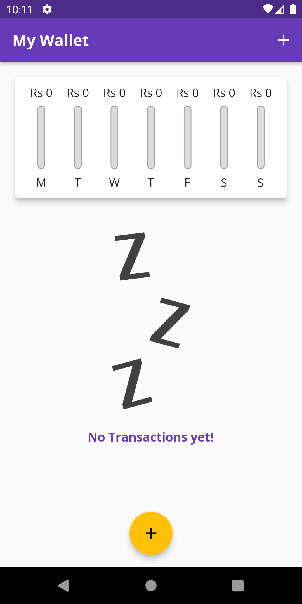
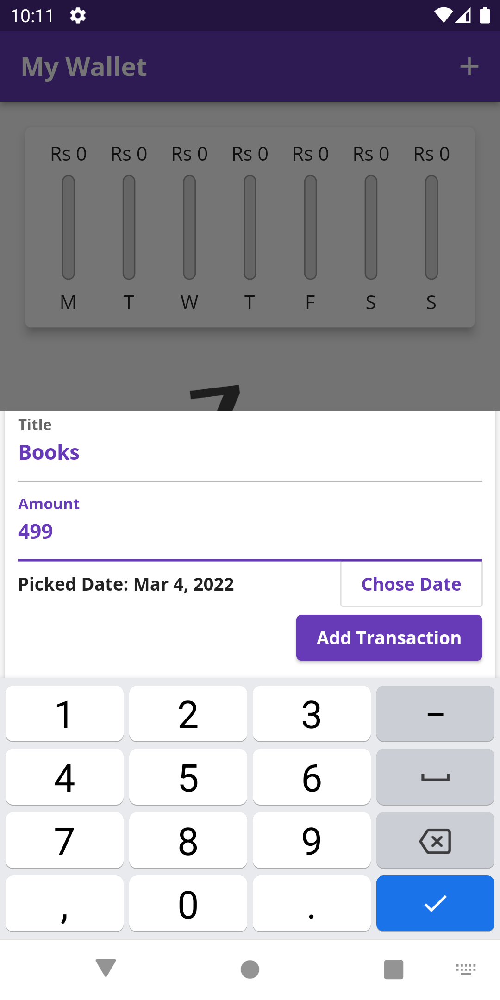
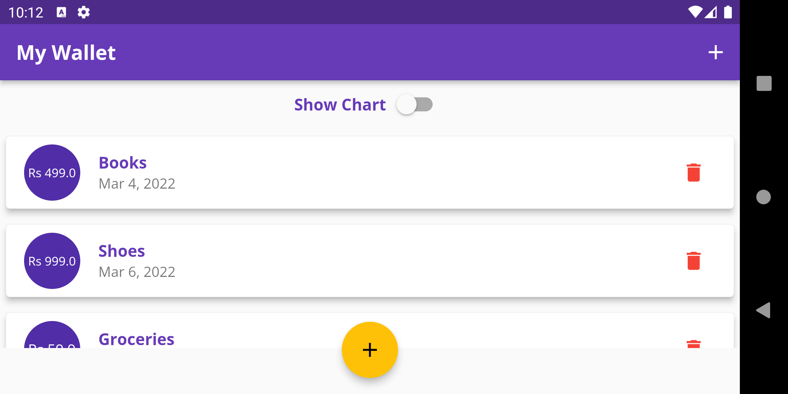
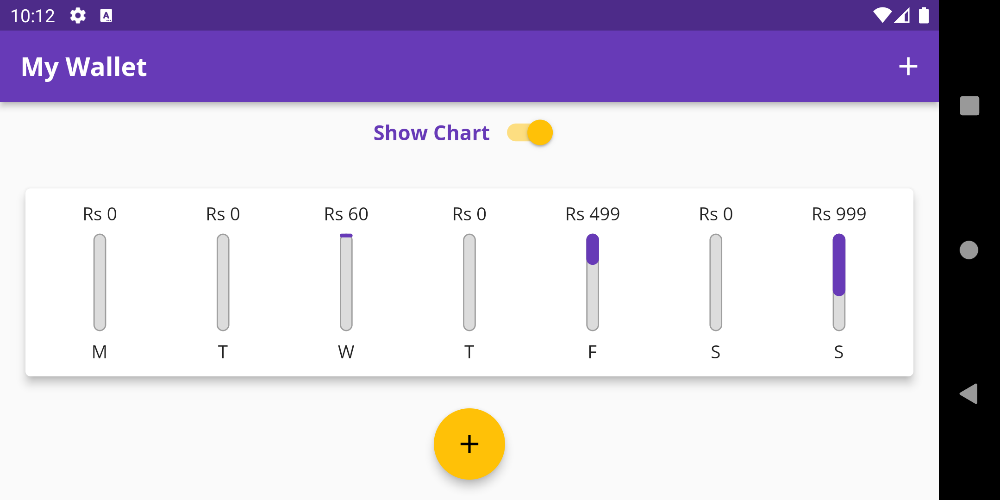

# MyWallet App

An app to keep track of all user transactions & display a bar graph showing transactions made on each day over the last week.

## Key Points

- Built with **Flutter** using the **Dart** & Flutter widgets
- **Material UI** Frontend for Android & **Cupertino** for iOS devices
- **Responsive** to all screen sizes,**Adaptive** to platform ( iOS / Android / Web ) & with Layout switching between Portrait / Landscape
- **Firebase** RealTime Database to store record of User Transactions

## ScreenShots

      
---
  
---

## Created & Maintained by

### **Amartya Yadav**
---
